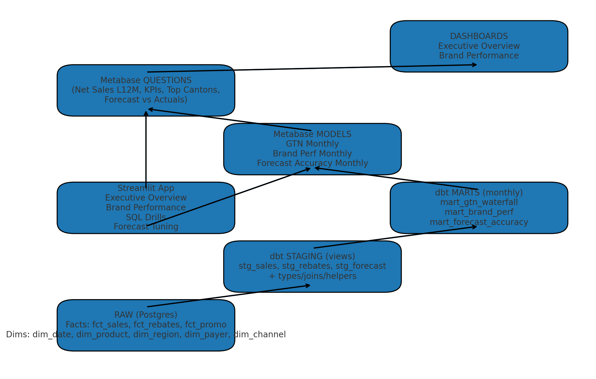

# RPS Analytics Sandbox — Case Study Cheat Sheet

## Table of Contents

- [1) Executive Summary (What to say in the first 2 minutes)](#1-executive-summary-what-to-say-in-the-first-2-minutes)
- [2) Architecture at a Glance](#2-architecture-at-a-glance)
- [3) Environment Runbook](#3-environment-runbook)
- [4) Data Model (Business View)](#4-data-model-business-view)
  - [Dimensions](#dimensions)
  - [Facts (daily grain)](#facts-daily-grain)
  - [Marts (monthly grain)](#marts-monthly-grain)
- [5) KPIs & Business Metrics](#5-kpis-business-metrics)
- [6) SQL Patterns (Copy/Paste)](#6-sql-patterns-copypaste)
  - [A) Period-over-Period with LAG (with month spine)](#a-period-over-period-with-lag-with-month-spine)
  - [B) De-dupe latest snapshot with ROW_NUMBER](#b-de-dupe-latest-snapshot-with-row_number)
  - [C) Join facts → dims (grain check)](#c-join-facts-dims-grain-check)
  - [D) Stockout flag & Days of Supply (7D rolling)](#d-stockout-flag-days-of-supply-7d-rolling)
  - [E) “Head” helpers (columns, PKs, sample rows)](#e-head-helpers-columns-pks-sample-rows)
- [7) dbt Structure & Conventions](#7-dbt-structure-conventions)
- [8) Metabase Quickstart](#8-metabase-quickstart)
- [9) Streamlit App Pages](#9-streamlit-app-pages)
- [10) Forecast Notes](#10-forecast-notes)
- [11) Common Pitfalls & Cleaning Tips](#11-common-pitfalls-cleaning-tips)
- [12) Interview Day Script & Slide Skeleton](#12-interview-day-script-slide-skeleton)
- [13) Troubleshooting](#13-troubleshooting)
- [2a) Architecture (ASCII quick reference)](#2a-architecture-ascii-quick-reference)
- [12) Interview Day Script & Slide Skeleton (Expanded)](#12-interview-day-script-slide-skeleton-expanded)
  - [Minute-by-minute flow (45–60 min case → 10–15 min readout)](#minute-by-minute-flow-4560-min-case-1015-min-readout)
  - [Slide / storyboard skeleton (4–5 slides)](#slide-storyboard-skeleton-45-slides)
  - [Talk tracks you can reuse (EN/DE)](#talk-tracks-you-can-reuse-ende)
  - [KPI formulas (refresher)](#kpi-formulas-refresher)
  - [Common pitfalls (and your one-liners)](#common-pitfalls-and-your-one-liners)
  - [If they push deeper (backup content)](#if-they-push-deeper-backup-content)

**Goal:** practice realistic pharma Business Analytics workflows end-to-end: SQL → dbt → marts → Streamlit → Metabase, with a simple forecast tuning loop.



---

## 1) Executive Summary (What to say in the first 2 minutes)

- _Decision focus:_ “This environment lets me prototype brand performance and forecast accuracy for Swiss pharma brands by month and canton, then present insights in dashboards.”
- _Data flow:_ Raw facts (daily) → dbt staging → monthly marts → Metabase models & dashboards; Streamlit for deeper analysis & forecast tuning.
- _Deliverables:_ KPI trends (Gross/Rebates/Net), brand deep dive, forecast vs actuals, and a simple baseline+uplift forecast with tunable α/β.

---

## 2) Architecture at a Glance

- **Raw (Postgres, schema `rps`):** `fct_sales`, `fct_rebates`, `fct_promo` + dims `dim_date`, `dim_product`, `dim_region`, `dim_payer`, `dim_channel`.
- **dbt staging:** `stg_sales`, `stg_rebates`, `stg_forecast` (clean joins, helpers).
- **dbt marts (monthly grain):** `mart_gtn_waterfall`, `mart_brand_perf`, `mart_forecast_accuracy`.
- **Metabase models:** “GTN Monthly”, “Brand Perf Monthly”, “Forecast Accuracy Monthly” (friendly fields & filters).
- **Dashboards:** Executive Overview, Brand Performance.
- **Streamlit:** Executive, Brand, SQL Drills, Forecast Tuning.

---

## 3) Environment Runbook

**URLS**

- Streamlit: `http://localhost:8501`
- Metabase: `http://localhost:3000`
- Postgres (inside Docker): host `postgres`, db `rps`, user `rps_user`, pwd `rps_password`

**One-shot reset & build**

```bash
make restart           # down -v → init schema → seed → dbt build → start app
make bootstrap         # assuming volumes exist: init → seed → dbt build
make dbt-build         # only dbt
make metabase-up       # start Metabase and print URL when healthy
```

**Caveat:** `docker compose down -v` wipes volumes (bye data & Metabase app DB). Use for clean rebuilds only.

---

## 4) Data Model (Business View)

### Dimensions

- `dim_date(date_id, year, month, week, month_start, week_start)` — continuous spine.
- `dim_product(product_id, brand, molecule, pack)` — brands, molecules.
- `dim_region(region_id, canton, region_name)` — Swiss cantons.
- `dim_payer(payer_id, payer_name)` — Helsana, CSS, SWICA, etc.
- `dim_channel(channel_id, channel_name)` — Pharmacy, Hospital, Digital.

### Facts (daily grain)

- `fct_sales(date_id, product_id, region_id, channel_id, units, gross_sales_chf)`
- `fct_rebates(date_id, product_id, region_id, payer_id, rebate_chf)`
- `fct_promo(date_id, product_id, region_id, channel_id, spend_chf, touchpoints)`
- `fct_forecast(date_id, product_id, region_id, baseline_units, uplift_units, forecast_units)`

### Marts (monthly grain)

- `mart_gtn_waterfall(year, month, brand, canton, gross_sales_chf, rebates_chf, net_sales_chf)`
- `mart_brand_perf(year, month, brand, canton, units, promo_spend)`
- `mart_forecast_accuracy(year, month, brand, canton, actual_units, forecast_units, abs_error_units, mape_pct)`

---

## 5) KPIs & Business Metrics

- **Gross Sales (CHF):** Σ `gross_sales_chf`
- **Rebates (CHF):** Σ `rebate_chf`
- **Net Sales (CHF):** **Gross − Rebates**
- **Units:** Σ `units`
- **Promo Spend (CHF):** Σ `spend_chf`
- **Growth vs Prior Month:** `(this_month − last_month) / last_month`
- **Growth vs LY Month:** `(this_year_same_month − last_year_same_month) / last_year_same_month`
- **MAPE (%):** `AVG(ABS(actual − forecast) / NULLIF(actual, 0))`
- **Abs Error:** `ABS(actual − forecast)`
- **Days of Supply:** `inventory_on_hand / avg_daily_demand`
- **Brand Mix %:** `brand_metric / Σ(metric)` within period

---

## 6) SQL Patterns (Copy/Paste)

### A) Period-over-Period with LAG (with month spine)

```sql
WITH month_spine AS (
  SELECT generate_series(
    date_trunc('month', CURRENT_DATE) - interval '35 months',
    date_trunc('month', CURRENT_DATE),
    interval '1 month'
  )::date AS month_start
),
monthly AS (
  SELECT
    make_date(year, month, 1) AS month_start,
    brand,
    SUM(net_sales_chf) AS net_sales
  FROM rps.mart_gtn_waterfall
  GROUP BY 1, 2
),
aligned AS (
  SELECT s.month_start, m.brand, COALESCE(m.net_sales, 0) AS net_sales
  FROM month_spine s
  LEFT JOIN monthly m USING (month_start)
)
SELECT
  month_start,
  brand,
  net_sales,
  LAG(net_sales) OVER (PARTITION BY brand ORDER BY month_start) AS lag_net,
  CASE WHEN LAG(net_sales) OVER (PARTITION BY brand ORDER BY month_start) IN (0, NULL) THEN NULL
       ELSE net_sales / LAG(net_sales) OVER (PARTITION BY brand ORDER BY month_start) - 1
  END AS pct_chg
FROM aligned
ORDER BY brand, month_start;
```

### B) De-dupe latest snapshot with ROW_NUMBER

```sql
WITH ranked AS (
  SELECT t.*,
         ROW_NUMBER() OVER (
           PARTITION BY business_key1, business_key2
           ORDER BY load_ts DESC, file_seq DESC
         ) AS rn
  FROM raw_table t
)
SELECT * FROM ranked WHERE rn = 1;
```

### C) Join facts → dims (grain check)

```sql
SELECT
  make_date(d.year, d.month, 1) AS month_start,
  p.brand, r.canton, c.channel_name,
  SUM(s.units) AS units, SUM(s.gross_sales_chf) AS gross_sales_chf
FROM rps.fct_sales s
LEFT JOIN rps.dim_date d     ON s.date_id    = d.date_id
LEFT JOIN rps.dim_product p  ON s.product_id = p.product_id
LEFT JOIN rps.dim_region r   ON s.region_id  = r.region_id
LEFT JOIN rps.dim_channel c  ON s.channel_id = c.channel_id
GROUP BY 1,2,3,4
ORDER BY 1,2,3;
```

### D) Stockout flag & Days of Supply (7D rolling)

```sql
WITH daily AS (
  SELECT d.date_actual, s.product_id, SUM(s.units) AS units
  FROM rps.fct_sales s
  JOIN rps.dim_date d ON s.date_id = d.date_id
  GROUP BY 1,2
),
rolling AS (
  SELECT
    date_actual, product_id, units,
    AVG(units) OVER (PARTITION BY product_id ORDER BY date_actual
                     ROWS BETWEEN 6 PRECEDING AND CURRENT ROW) AS avg_7d_units
  FROM daily
),
inv AS (
  SELECT
    r.date_actual, r.product_id, r.avg_7d_units,
    GREATEST(0, 2000 - SUM(r.units) OVER (PARTITION BY r.product_id ORDER BY r.date_actual)) AS inventory_on_hand,
    300::int AS reorder_point
  FROM rolling r
)
SELECT
  date_actual, product_id, inventory_on_hand, reorder_point, avg_7d_units,
  CASE WHEN inventory_on_hand <= reorder_point THEN 1 ELSE 0 END AS stockout_flag,
  CASE WHEN COALESCE(avg_7d_units,0)=0 THEN NULL ELSE inventory_on_hand/avg_7d_units END AS days_of_supply
FROM inv
ORDER BY product_id, date_actual;
```

### E) “Head” helpers (columns, PKs, sample rows)

```sql
-- Columns & types
SELECT column_name, data_type
FROM information_schema.columns
WHERE table_schema = 'rps' AND table_name = 'fct_sales'
ORDER BY ordinal_position;

-- Primary keys (if defined)
SELECT conname AS constraint_name, pg_catalog.pg_get_constraintdef(c.oid, true) AS definition
FROM pg_catalog.pg_constraint c
JOIN pg_catalog.pg_class t ON c.conrelid = t.oid
JOIN pg_catalog.pg_namespace n ON n.oid = t.relnamespace
WHERE c.contype = 'p' AND n.nspname = 'rps' AND t.relname = 'fct_sales';

-- Sample rows
SELECT * FROM rps.mart_gtn_waterfall ORDER BY year DESC, month DESC LIMIT 20;
```

---

## 7) dbt Structure & Conventions

- `stg_*` for clean joins & helpers (one-to-one with sources).
- `mart_*` for business grain (monthly brand/canton).
- Rebuild: `make dbt-build` (compiled SQL in `dbt/target/`).
- For production: add tests (unique, not_null, relationships) on keys.

---

## 8) Metabase Quickstart

- Create models over marts (add `period = make_date(year,month,1)`).
- Build Questions: Net Sales L12M, KPIs, Top Cantons, Forecast vs Actuals, MAPE by Brand.
- Dashboards: Executive Overview, Brand Performance with filters (Month/Brand/Canton).
- If fields change: Admin → Databases → Sync & Re-scan.

---

## 9) Streamlit App Pages

- **Executive Overview**: KPI tiles, net vs gross trend, top cantons.
- **Brand Performance**: Units & sales trend, by-canton table.
- **SQL Drills**: interactive editor + ready-made patterns.
- **Forecast Tuning**: manual α/β or fit (OLS/grid/robust), save & load params per scope.

---

## 10) Forecast Notes

- **Model:** `forecast = baseline + uplift`
  - baseline = 4-period moving average (shifted 1), per product-region
  - uplift = α _ promo_spend + β _ rebate_rate \* units_total
- **MAPE:** `AVG(|actual - forecast| / NULLIF(actual,0))`
- **Fitting:** OLS (least squares), grid search, robust (Huber). Constrain α/β ranges; consider promo lags.
- **Limitations:** illustrative; for production consider hierarchical models, seasonality, and exogenous regressors.

---

## 11) Common Pitfalls & Cleaning Tips

- **Double counting:** never join fact↔fact at detail grain; aggregate first or join via dims.
- **Grain mismatch:** align daily facts to monthly before joining to monthly forecasts.
- **Missing months:** create a month spine to avoid LAG/rolling skips.
- **Dim duplicates:** de-dupe dims in `stg_*` before joins.
- **Types & dates:** cast to correct types; ensure `month_start` is real date.
- **Outliers:** winsorize or cap where appropriate for robust metrics.

**Examples**
_Remove dupes:_

```sql
WITH x AS (
  SELECT *, ROW_NUMBER() OVER (PARTITION BY product_id ORDER BY updated_at DESC) rn
  FROM rps.dim_product_raw
)
SELECT * FROM x WHERE rn=1;
```

_Enforce monthly grain:_

```sql
SELECT make_date(d.year,d.month,1) AS month_start, p.brand, r.canton, SUM(s.units) AS units
FROM rps.fct_sales s
JOIN rps.dim_date d ON s.date_id=d.date_id
JOIN rps.dim_product p ON s.product_id=p.product_id
JOIN rps.dim_region r ON s.region_id=r.region_id
GROUP BY 1,2,3;
```

---

## 12) Interview Day Script & Slide Skeleton

- **Opener (30s):** “Decision we’ll inform today is X. KPIs are Net Sales, Units, Forecast Error.”
- **QA check (1 min):** date ranges, nulls, duplicates, joins.
- **Evidence (3 charts):** L12M trend, variance or forecast error, segment deep dive.
- **Recommendation:** 1 line + quantified impact; **Risks** & **Next steps**.
- **Close:** automation plan (dbt + SAC/Tableau), data quality ownership.

---

## 13) Troubleshooting

- **No data in app:** run `make restart`.
- **dbt errors:** check `dbt/target/run/...sql` compiled code.
- **Metabase missing fields:** Admin → Sync now; then refresh.
- **Docker build issues:** `docker compose logs <service>`; `docker system prune` if low disk.

---

**Good luck — you’ve got this.**

---

## 2a) Architecture (ASCII quick reference)

```
                ┌───────────────────────── RAW (Postgres) ─────────────────────────┐
                │  Facts (daily):                                                  │
                │    rps.fct_sales, rps.fct_rebates, rps.fct_promo                 │
                │  Dims:                                                           │
                │    rps.dim_date, dim_product, dim_region, dim_payer, dim_channel │
                └──────────────────────────────────────────────────────────────────┘
                                      │
                                      ▼
                 ┌──────────────────── dbt STAGING views (stg_*) ───────────────────┐
                 │ Clean types, join dims, add helpers (month_start, etc.)          │
                 │   stg_sales, stg_rebates, stg_forecast                           │
                 └──────────────────────────────────────────────────────────────────┘
                                      │
                                      ▼
                ┌───────────────────── dbt MARTS (business grain) ───────────────────┐
                │ Monthly, business-ready tables                                     │
                │  mart_gtn_waterfall  → gross, rebates, NET by month/brand/canton  │
                │  mart_brand_perf     → units & promo_spend by month/brand/canton  │
                │  mart_forecast_accuracy → actual vs forecast, abs_error, MAPE     │
                └──────────────────────────────────────────────────────────────────┘
                                      │
                                      ▼
             ┌──────────────────────── Metabase MODELS (semantic layer) ─────────────┐
             │ Saved SQL over marts with friendly fields (period/brand/canton, etc.) │
             │  Model: GTN Monthly / Brand Perf Monthly / Forecast Accuracy Monthly  │
             └──────────────────────────────────────────────────────────────────────┘
                                      │
                                      ▼
                         ┌──────────── Metabase QUESTIONS ────────────┐
                         │ KPIs, trends, tables built on models       │
                         │ (e.g., Net Sales L12M, Top Cantons, MAPE)  │
                         └─────────────────────────────────────────────┘
                                      │
                                      ▼
                           ┌───────── DASHBOARDS ─────────┐
                           │ Executive Overview / Brand    │
                           │ filters: Month / Brand / Canton│
                           └───────────────────────────────┘
```

---

## 12) Interview Day Script & Slide Skeleton (Expanded)

### Minute-by-minute flow (45–60 min case → 10–15 min readout)

**0–1 min — Frame the decision**

- “To make this concrete: today’s decision is **which brand/canton to prioritize** for Q4 and **how far we are off plan**.”
- If unclear: “Is the primary KPI **Net Sales** or **Units**? And monthly or weekly view?”

**1–3 min — Define KPIs & success**

- “I’ll focus on **Net Sales (Gross − Rebates)**, **Units**, **Promo Spend**, and **Forecast Error (MAPE)**. A good outcome is: top growth drivers, risks, and 2–3 actions.”

**3–6 min — Rapid data sanity**
Say what you’re checking, then run 1–2 quick queries (or describe):

- Ranges: “Do we have the last 12–24 months?”
- Duplicates: “Any duplicate keys at monthly grain?”
- Joins: “Facts align to dims (brand/canton) and **monthly grain** before joins.”

Quick SQL you can paste:

```sql
-- Date coverage
SELECT MIN(date_actual), MAX(date_actual) FROM rps.dim_date;

-- Dupes at monthly grain (sales)
WITH m AS (
  SELECT make_date(d.year,d.month,1) AS month_start, product_id, region_id, COUNT(*) c
  FROM rps.fct_sales s JOIN rps.dim_date d ON s.date_id=d.date_id
  GROUP BY 1,2,3
)
SELECT * FROM m WHERE c > 31 LIMIT 10; -- sanity for daily rows per month
```

**6–12 min — Minimal model & cuts**

- L12M trend for Gross/Net/Units (overall).
- Variance table (Actual vs Forecast, abs error, MAPE).
- One deep dive cut (by Brand or Canton).

**12–18 min — Findings → Recommendation**

- “**Recommendation**: Shift **15% promo** from Brand A to Brand B in Regions ZH & VD; expected +X% Net Sales in Q4.”
- “**Why**: B shows positive elasticity (promo → units), low rebate burden.”

**18–20 min — Risks & next steps**

- “Risk: forecast sensitivity to rebate mix. Mitigation: monitor weekly MAPE; cap promo in low-response cantons.”
- “Next steps: AB-test digital spend; align with Access on payer rebates.”

---

### Slide / storyboard skeleton (4–5 slides)

1. **Title = your recommendation**
   - Subtitle: decision & KPI focus.

2. **KPI tiles + L12M trend**
   - Gross, Rebates, Net, Units (latest month).
   - Line: Net vs Gross with annotations for major events.

3. **Variance / Forecast accuracy**
   - Table: Actual, Forecast, Abs Error, MAPE (latest 3–6 months).
   - Comment on bias/systematic error.

4. **Deep dive cut** (Brand or Canton)
   - Bar/heatmap of Net Sales or MAPE by segment.
   - One anomaly called out with hypothesis.

5. **Risks & next steps**
   - 3 bullets risk, 3 bullets action/owner/timeline.

---

### Talk tracks you can reuse (EN/DE)

- EN: “Before building charts, I anchor on the **decision and KPI** to avoid interesting-but-irrelevant work.”
- DE: “Bevor ich Visualisierungen erstelle, **kläre ich Entscheidung und KPI**, um zielgerichtet zu arbeiten.”

- EN: “I aligned all facts to **monthly grain** before joining to forecasts to avoid grain mismatch.”
- DE: “Ich habe die Fakten auf **Monats-Grain** aggregiert, **bevor** ich Forecasts gejoint habe, um Grain-Fehler zu vermeiden.”

- EN: “Promo shows **positive uplift** for Brand B in ZH/VD; rebate rate is lower, so **net** response is stronger.”
- DE: “Für Brand B in ZH/VD sehen wir **positiven Uplift**; bei niedrigerer Rabattquote ist der **Netto-Effekt** stärker.”

---

### KPI formulas (refresher)

- **Net Sales (CHF)** = Gross − Rebates
- **Growth MoM** = (This − Last) / Last
- **MAPE** = AVG( |Actual − Forecast| / NULLIF(Actual, 0) )

---

### Common pitfalls (and your one-liners)

- **Double counting:** “I didn’t join facts to facts; I aggregated then joined via dims.”
- **Grain mismatch:** “All comparisons happen at monthly grain.”
- **Missing months:** “Built/used month spine so LAG/rolling don’t skip.”
- **Dim duplicates:** “De-duped dim keys in staging.”

---

### If they push deeper (backup content)

- **Elasticity demo:** show Forecast Tuning page; explain α (promo) / β (rebate-rate\*units).
- **Data quality:** show one SQL test you’d add in dbt (`unique + not_null` on `dim_product.product_id`).
- **Industrialization:** “Prototype in Tableau/Streamlit → productionize in SAC/dbt with schedule + monitoring.”
